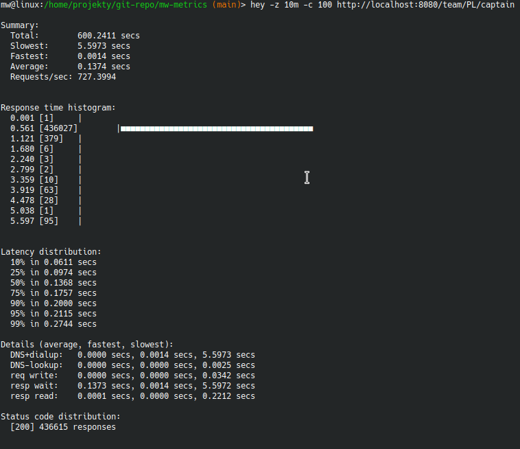
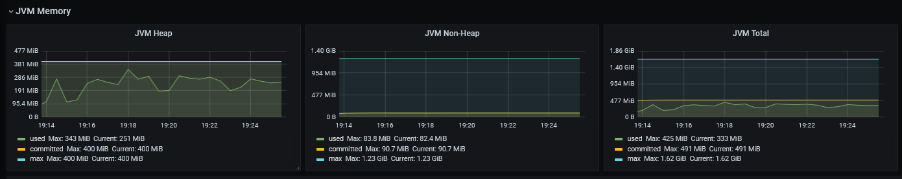
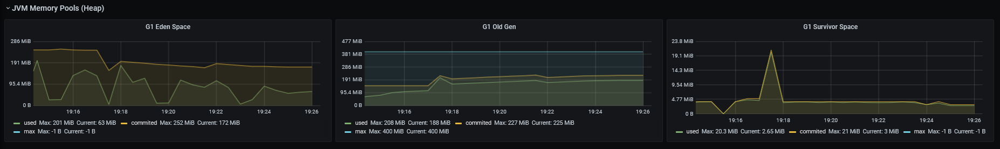

= Test construction

The test is structured as follows. The client communicates with the controller and can perform two actions "captain" and "score". Each of them communicates with a different controller (via WebClient). After the "captain" action, TeamController communicates with TeamPlayersController,
and after the "score" action, TeamController communicates with TemDetailsController.

One of these resources is slow responding.

== Test common structure

[plantuml]
....
@startuml
!include header.puml

Person(user, User, "          User          ")

Container_Boundary(api, "API Application") {
   Component(team, "Football Teams Controller", "MVC Rest Controlle", "Allows users to get basic info about teams")
   Component(team_details, "Football Teams Detailed Info Controller", "MVC Rest Controlle", "Allows users to get detailed info about teams")
   Component(team_players, "Football Teams Player Info Controller", "MVC Rest Controlle", "Allows users to get basic info about teams players")
}
Rel(user,team,"captain")
Rel(team,team_details,"(details) -  WebClient communication, slow responding resource")
Rel(team,team_players,"(players) - WebClient communication")
@enduml
....

== Test "captain" path communication
-
[plantuml]
....
@startuml
!include header.puml

Person(user, User, "          User          ")

Container_Boundary(api, "API Application") {
   Component(team, "Football Teams Controller", "MVC Rest Controlle", "Allows users to get basic info about teams")
   Component(team_players, "Football Teams Player Info Controller", "MVC Rest Controlle", "Allows users to get basic info about teams players")
}

Rel(user,team,"captain")

Rel(team,team_players,"(players) - WebClient communication")
@enduml
....

== Test "score" path communication

[plantuml]
....
@startuml
!include header.puml

Person(user, User, "          User          ")

Container_Boundary(api, "API Application") {
   Component(team, "Football Teams Controller", "MVC Rest Controlle", "Allows users to get basic info about teams")
   Component(team_details, "Football Teams Detailed Info Controller", "MVC Rest Controlle", "Allows users to get detailed info about teams")

}

Rel(user,team,"score")

Rel(team,team_details,"(details) -  WebClient communication, slow responding resource")
@enduml
....

== Environment configuration

|===
| Property | Value

|Environment|Spring`boot

|Web server
|Tomcat

|Maximum amount of worker threads (server.tomcat.threads.max)
|200

|Maximum queue length for incoming connection requests when all possible request processing threads are in use. (server.tomcat.accept-count)
|100
|===

_https://docs.spring.io/spring-boot/docs/current/reference/html/application-properties.html#application-properties.web_

|===
|Tool | Role

|h2load,ab,hey,wrk
|Benchmark tools

|Micrometer,Prometheus,Grafana
|Monitoring

|http://gclogs.com/
|GC logs analyser
|===

== Test - scenario 1

=== Test configuration

Traffic with the following parameters was generated:

....
hey -z 10m -c 100 http://localhost:8080/team/PL/score
....

....
hey -z 10m -c 100 http://localhost:8080/team/PL/captain
....

=== Results

== Test - scenario 2 - memory leak (static collection)

=== Test configuration

There have been some changes to the test setup.

First of all, the Heap area has been decreased to 400 MB:

....
java -Xmx400M -Xms400M -jar build/libs/metrics-0.0.1-SNAPSHOT.jar
....

Secondly, a memory leak was simulated.

There is a static list of objects in the service class that is populated with each request.

....
public class TeamService {

    public static List<Object> db=new ArrayList<>(100000);

    public TeamScoreDTO score(TeamCode teamCode) {
        db.add(new MyObject("Score", rand.nextInt()));
        db.add(rand.nextInt());
        return TeamScoreDTO.from(teamCode,result.getPosition());
    }

    public TeamCaptainDTO captain(TeamCode teamCode) {
        db.add(new MyObject("Captain", rand.nextInt()));
        db.add(rand.nextInt());
        return TeamCaptainDTO.from(teamCode, result.getCaptain());
    }
....

Third, an additional load on the application has been generated. For this purpose, 1000 threads were created, which after 2 minutes of sleep, arise and fill the static list with additional objects

....

public class MetricsConfiguration {

   @PostConstruct
    public void init() {
        for (int i = 0; i < 1000; i++) {
            (new MyThread()).start();
            log.info("Thread created=>" + i);
        }
    }

}

class MyThread extends Thread {

   // List<MyObject> list = new ArrayList<>(600);

    @Override
    public void run() {
        Sleeper.sleepSecconds(120);
        mwstart();
        Sleeper.sleepSecconds(120);
        mwstart();
    }

    private void mwstart() {
        for (int i = 0; i < 1000; i++) {
            var item = new MyObject(Thread.currentThread().getName(), i);
            TeamService.db.add(item);
        }
    }
}
....

Traffic with the following parameters was generated:

....
hey -z 10m -c 100 http://localhost:8080/team/PL/score
....

....
hey -z 10m -c 100 http://localhost:8080/team/PL/captain
....

=== Results

== Appendix - additional tests - TODO

Additionally, the application creates 6000 sleeping threads at startup. 5 minutes after it starts, threads activate and fill their object arrays while monitoring is in progress. This places additional strain and resource utilization.
....

 @PostConstruct
    public void init(){
        for (int i = 0; i < 6000; i++) {
            (new MyThread()).start();
            log.info("Thread created=>"+i);
        }
    }

....

[java]
....
class MyThread extends Thread{
    List<MyObject> list = new ArrayList<>(200);

    @Override
    public void run() {
        try {
            Thread.sleep(500*1000);
        } catch (InterruptedException e) {
            throw new IllegalArgumentException(e);
        }

    }

    private void mwstart() {
        for (int i = 0; i < 600; i++) {
            list.add(new MyObject(Thread.currentThread().getName(),i));
            System.out.println("New Object added! Thread=>"+Thread.currentThread().getName());
        }
    }
}

@AllArgsConstructor
class MyObject{
    String name;
    Integer account;
}

....

=== Resources:

https://youtu.be/fLXp81DuyPU

=== Another tools

....
ab -n 1000 -c 100  http://localhost:8080/team/PL/captain
....

....
h2load  -n1000000 -c100   http://localhost:8080/team/PL/captain -v --log-file=log.txt --h1
....

....
wrk -c150   http://localhost:8080/team/PL/captain -d 10m
....

....
hey -z 10m -c 100 http://localhost:8080/team/PL/score
....